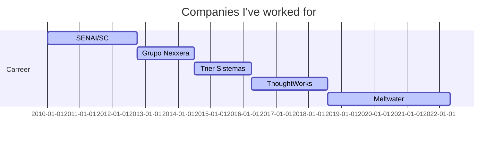

### Hi there 👋
My name is Henrique and I am from Brazil. 

I am currently building and breaking software remotely for [Meltwater](https://www.github.com/meltwater).

  
  
---
  
  I'm also the creator and maintainer of Gamersclub Booster, an open source chrome extension for counter-strike players at Gamersclub platform. It currently has  downloads. Click the link below to see the repository and go check it out! :)
  
  

---
<!--

  
  
  

-->

---

   
  
   
  

